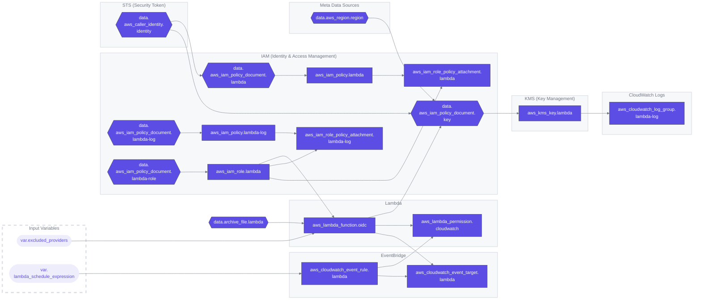

# terraform-aws-lambda-update-oidc-provider

## terraform graph

```mermaid
%%tfmermaid
%%{init:{"theme":"default","themeVariables":{"lineColor":"#6f7682","textColor":"#6f7682"}}}%%
flowchart LR
classDef r fill:#5c4ee5,stroke:#444,color:#fff
classDef v fill:#eeedfc,stroke:#eeedfc,color:#5c4ee5
classDef ms fill:none,stroke:#dce0e6,stroke-width:2px
classDef vs fill:none,stroke:#dce0e6,stroke-width:4px,stroke-dasharray:10
classDef ps fill:none,stroke:none
classDef cs fill:#f7f8fa,stroke:#dce0e6,stroke-width:2px
subgraph "n0"["EventBridge"]
n1["aws_cloudwatch_event_rule.<br/>lambda"]:::r
n2["aws_cloudwatch_event_target.<br/>lambda"]:::r
end
class n0 cs
subgraph "n3"["CloudWatch Logs"]
n4["aws_cloudwatch_log_group.<br/>lambda-log"]:::r
end
class n3 cs
subgraph "n5"["IAM (Identity & Access Management)"]
n6["aws_iam_policy.lambda"]:::r
n7["aws_iam_policy.lambda-log"]:::r
n8["aws_iam_role.lambda"]:::r
n9["aws_iam_role_policy_attachment.<br/>lambda"]:::r
na["aws_iam_role_policy_attachment.<br/>lambda-log"]:::r
nb{{"data.<br/>aws_iam_policy_document.<br/>key"}}:::r
nc{{"data.<br/>aws_iam_policy_document.<br/>lambda"}}:::r
nd{{"data.<br/>aws_iam_policy_document.<br/>lambda-log"}}:::r
ne{{"data.<br/>aws_iam_policy_document.<br/>lambda-role"}}:::r
end
class n5 cs
subgraph "nf"["KMS (Key Management)"]
ng["aws_kms_key.lambda"]:::r
end
class nf cs
subgraph "nh"["Lambda"]
ni["aws_lambda_function.oidc"]:::r
nj["aws_lambda_permission.<br/>cloudwatch"]:::r
end
class nh cs
nk{{"data.archive_file.lambda"}}:::r
subgraph "nl"["STS (Security Token)"]
nm{{"data.<br/>aws_caller_identity.<br/>identity"}}:::r
end
class nl cs
subgraph "nn"["Meta Data Sources"]
no{{"data.aws_region.region"}}:::r
end
class nn cs
subgraph "np"["Input Variables"]
nq(["var.excluded_providers"]):::v
nr(["var.<br/>lambda_schedule_expression"]):::v
end
class np vs
nr---->n1
n1-->n2
ni-->n2
ng-->n4
nc-->n6
nd-->n7
ne-->n8
n6-->n9
n8-->n9
n7-->na
n8-->na
nb-->ng
n8-->ni
nk-->ni
nq---->ni
n1-->nj
ni-->nj
ni-->nb
nm-->nb
no-->nb
nm-->nc
```

